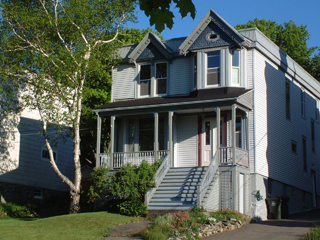

#### Welcome to our Bed & Breakfast in the wonderful city of Saint John. ####

**We are delighted that our home has been selected for inclusion in the Canadian Register of Historic Places**
  
**For Online Reservations click [Here](https://m.bbcanada.com/10812.html)**

2022 is our 14th year of operating our Bed & Breakfast and we have enjoyed hosting families and couples from as far away as Australia, Argentina and Europe and we are excited and looking forward to welcoming you to our home in Saint John.

We are located a very short walk from the spectacular 2200 acre Rockwood Park and the beautiful Lily Lake which now boasts Lilys Cafe a restaurant overlooking the lake serving great food and drinks. Lily Lake has just had solar powered lighting installed making for a very pleasant stroll during the evening at dusk.

Originally from the United Kingdom, Helena from England and Garth from Northern Ireland, we have both been  involved within the Tourism and Travel industry all our lives.

We offer 3 rooms, our feature room is the Fundy Bay Room and is ideal for a Romantic break or Weekend away featuring a large bathroom with Whirlpool Bath and Shower.  The Deer View room enjoys a Private Bathroom and our Seely Suite is just a little bit different, we know you will enjoy it.

Our B&B is in a wonderful location just 200 metres from Saint John Public Gardens and a short walk further on will bring you to Rockwood Park and the beautiful Lily Lake, ideal for walking, running and Mountain Biking in summer and skating or snowshoeing in winter. We have very easy access to the Highway and are only a 5 minute drive to Uptown Saint John and the restaurant at Lily's Cafe is only a 5-10min walk away in Rockwood Park.

**We offer**

* No Smoking Rooms
* Private Off-Road Parking
* Internet Access
* Netflix
* Radio Alarms                                       .

We hope you enjoy our website and look forward to welcoming you in the near future.

For Reservations or to check availability :-  
<i data-feather="phone"></i> (506) 721 1553  
For Online Reservations click [Here](https://m.bbcanada.com/10812.html)  
<i data-feather="mail"></i> <garth@seelystreet.com>

Please also check out our other Websites - [Fundy Sports Toursim](http://fundysportstourism.com)

